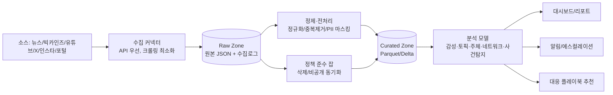
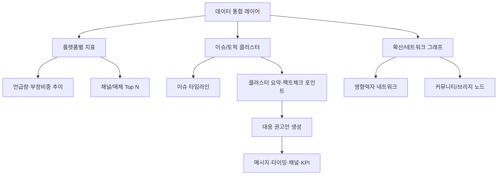
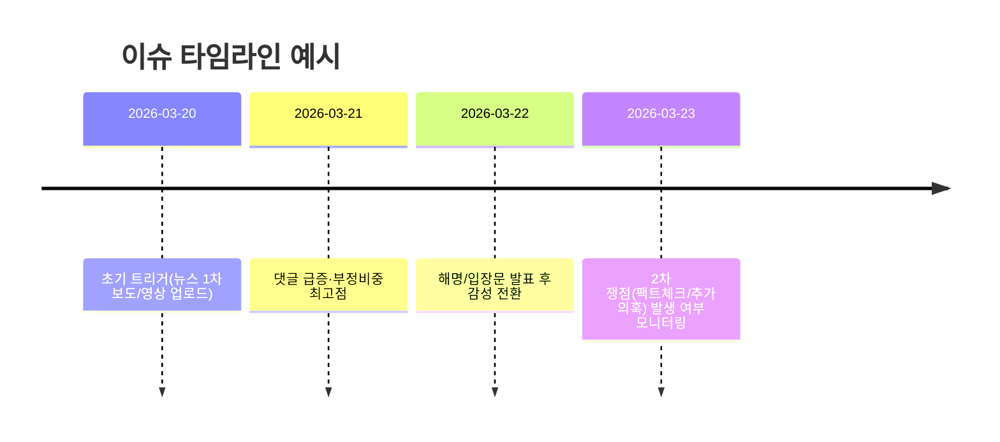
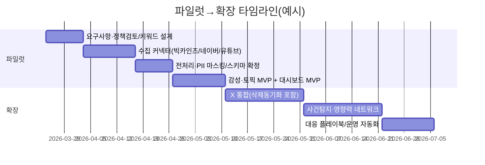

# 기사·댓글 기반 인물 여론 평가 분석 및 대응 제시 프로젝트 리서치

**Executive summary:** 본 보고서는 한국어 뉴스/댓글·소셜 반응을 통합 수집·분석해 “인물(정치인·연예인·셀럽 등)에 대한 여론(감성·이슈·확산·영향력) 평가”를 정량화하고, 이를 근거로 위기·기회 시나리오별 **대응 메시지/타이밍/채널/KPI**를 제시하는 데이터·AI 프로젝트의 설계안을 제안한다. 핵심은 (1) 합법·약관 준수형 데이터 소싱, (2) 한국어 특화 모델 기반의 신뢰 가능한 분석, (3) 운영 가능한 대시보드·알림·거버넌스 체계의 결합이다. citeturn28view0turn23search22turn2search2turn15view4turn21view0

## 프로젝트 목적과 성공 정의

이 프로젝트의 목적은 “한 인물에 대한 여론을 **플랫폼별·시간대별·이슈별로 구조화**하여 (a) 현재 평판 상태를 설명하고, (b) 급변을 조기 감지하며, (c) 실행 가능한 대응 권고로 연결”하는 것이다. 여기서 ‘여론’은 단순 호불호가 아니라 **기사/콘텐츠(의제) + 댓글/게시물(반응) + 확산(네트워크) + 사건(트리거)**의 결합으로 정의하는 편이 운영·설명력 측면에서 유리하다.

정성 목표는 다음 네 가지로 수렴하는 것이 일반적이다. 첫째, 내부 의사결정자가 5~10분 내 맥락을 이해할 수 있는 **일일 브리프(“무슨 일이 있었고, 누가 어떤 감정으로, 어디서 확산했는가”)** 제공. 둘째, 위기 가능 이슈의 **조기 경보(early warning)**와 “반드시 확인할 사실(팩트체크·정정 포인트)”를 자동 요약. 셋째, 사후에 “어떤 대응이 어떤 지표를 개선/악화시켰는지”를 추적 가능한 **학습 루프** 구축. 넷째, 분석 결과가 조작·편향 논란에 휘말리지 않도록 **투명한 근거(데이터 출처/기간/샘플링/한계)**를 보고서·대시보드에 상시 노출하는 것이다. citeturn24search2turn2search9

정량 목표는 “분석 성능”과 “운영 성과(비즈니스 KPI)”를 분리해 설계해야 한다.

분석 성능(KPI 예시)

- 감성/정서 분류: **Macro-F1 ≥ 0.80**(플랫폼별 별도 목표), 부정(위기) 클래스 재현율 **R ≥ 0.85**(알림 목적이면 재현율 우선).
- 의견 주체(누가/무엇을 비난·지지하는가) 태깅: 엔터티 단위 **Span-F1** 또는 엔터티-감성 결합 **F1**(샘플링된 검증 세트 기준).
- 사건 탐지: 골든 이벤트(사후 합의된 사건 리스트) 대비 탐지 **리드타임 중앙값 30~120분**(플랫폼에 따라 상이) 및 오탐률(불필요 알림) 목표 설정.

운영 성과(KPI 예시)

- 위기: (1) 부정 비중(negativity share) 상승 구간에서 **공식 채널 메시지 도달/참여율**, (2) “오해/허위 주장” 클러스터의 확산 속도 감소, (3) 부정 감성 “지속 기간” 단축.
- 기회: (1) 호의적 이슈의 SOV(Share of Voice) 증대, (2) 긍정 확산에 기여한 크리에이터/매체와의 협업 전환율.

특히 위기 목적이라면 “정확도”보다 **부정·리스크 클래스 재현율**과 **경보 지연(latency)**이 더 중요한 경우가 많다. citeturn23search20turn15view0

## 데이터 소스와 API·크롤링 가능성, 법적·윤리적 제약

### 우선순위 원칙

요청하신 우선순위(주요 한국 신문사 → 유튜브 → X → 인스타그램 → 포털 댓글)를 유지하되, **‘공식 접근(계약/공식 API)’ 가능성**과 **‘저작권·약관·개인정보’ 리스크**를 함께 고려해야 한다. 예를 들어 뉴스는 저작권·전재 이슈가 강하고, 소셜은 플랫폼 약관 및 데이터 보관/재배포 제한이 강하다. citeturn22search5turn18search19turn15view4turn14view2

### 소스별 현실적 수집 옵션 요약

아래 표는 “권장(합법·유지보수 용이)” 중심의 조합이다.

| 우선순위 | 소스                           | 공식/준공식 수집 경로                                       | 수집 가능 데이터(대표)                                                              | 제약·리스크(핵심)                                                                                                                                                                                                                                          |
| -------- | ------------------------------ | ----------------------------------------------------------- | ----------------------------------------------------------------------------------- | ---------------------------------------------------------------------------------------------------------------------------------------------------------------------------------------------------------------------------------------------------------- |
| 상       | 한국 주요 언론(다수 매체 커버) | **네이버 검색 API(뉴스)**: REST, JSON/XML, 일 25,000회 한도 | 뉴스 검색 결과(제목/요약/원문 링크/발행시각)                                        | 네이버 결과는 “검색 결과”이며, 원문 전체 텍스트는 각 언론사 정책/저작권에 좌우(추가 계약 필요 가능). citeturn28view0turn22search5                                                                                                                      |
| 상       | 한국 언론(아카이브·분석용)     | **빅카인즈 OpenAPI**(한국언론진흥재단)                      | 뉴스 검색/분석용 API(검색 조건·언론사 필터 등), 본문은 200자 제한 등 필드 정책 존재 | POST+JSON/인증키 기반, 응답 필드/제한 준수 필요. 기사 저작물 전재·복제·배포 금지 고지. citeturn21view0turn21view1turn21view2turn18search19                                                                                                           |
| 상       | 유튜브(채널·영상·댓글)         | **YouTube Data API v3**                                     | 영상/채널 메타, 댓글 스레드(예: commentThreads.list)                                | 기본 할당량 10,000 units/day(프로젝트 단위). 메서드별 quota cost 존재(예: commentThreads.list 비용 1). citeturn23search5turn23search0turn23search22                                                                                                   |
| 중       | X(트위터)                      | **X API(공식 문서/약관 기반)**                              | 게시물/대화/메타(계정 플랜·권한에 따라 상이)                                        | (1) 오프라인 저장 시 삭제/수정 동기화 의무(삭제되면 합리적 범위 내, 또는 24시간 내 처리). (2) X 콘텐츠로 파운데이션/프론티어 모델 학습·파인튜닝 금지. (3) 심리프로파일링·극단적 신원조회 등 제한 use case 존재. citeturn14view2turn15view4turn15view0 |
| 중~하    | 인스타그램                     | **Instagram Graph API(권한 기반)**                          | 앱 사용자 소유 IG 미디어의 댓글 조회/답글/숨김/삭제 등                              | “앱 사용자 소유 미디어” 중심으로 제공(공개 전체 크롤링과 성격 다름). 대규모 ‘여론’ 수집은 보통 제휴/권한 이슈로 제한. citeturn17search0                                                                                                                 |
| 하       | 포털 댓글(네이버/다음 등)      | 원칙적으로 **공식 제휴·데이터 제공 계약** 권장              | 기사 댓글/공감/대댓글 등                                                            | 공식 API 부재/제한 가능성이 높아 무단 크롤링은 약관·법적 리스크가 큼. 개인정보(닉네임/프로필/식별자) 포함 가능 → 최소수집·가명처리 필요. citeturn2search2turn2search9                                                                                  |

### 법적·윤리적 준수 체크리스트(핵심만)

개인정보보호: 한국 「개인정보 보호법」은 ‘다른 정보와 쉽게 결합해 개인을 알아볼 수 있는 정보’도 개인정보에 포함하고, ‘가명정보’ 및 ‘가명처리’ 개념을 명확히 둔다. 따라서 댓글/게시물에서 **핸들·닉네임·프로필 링크·위치·사진·연락처** 등은 기본적으로 개인정보 취급 가능성이 있으므로, 데이터 레이크에는 원문을 저장하더라도 **식별자 분리·해시·가명처리·접근통제**가 필요하다. citeturn2search2turn2search9  
또한 개인정보처리자는 원칙적으로 **개인정보 보호책임자 지정** 의무가 있으며(규모 예외는 별도), 이 프로젝트는 운영 체계에 DPO/보안담당을 포함하는 편이 안전하다. citeturn2search8

저작권: 뉴스·영상·댓글은 저작물/콘텐츠로서 저작권법 보호 대상이 될 수 있으며, 특히 빅카인즈는 “제공 기사 전재·복제·배포 금지”를 명시한다. 따라서 대시보드에는 원문 전체를 복제하기보다 **짧은 인용/요약 + 원문 링크 + 내부 열람 권한 통제** 방식이 일반적이다. citeturn18search19turn22search5

플랫폼 약관: X는 오프라인 저장 콘텐츠의 삭제 동기화(요청 시 24시간 내 등) 의무를 정책에 명시하고, X 콘텐츠를 기반 모델 학습/파인튜닝에 사용 금지 조항을 계약에 포함한다. 즉 “LLM을 쓰더라도” X 데이터를 **학습 데이터셋으로 축적**하는 형태(파인튜닝/사내 파운데이션 모델 학습)는 금지될 수 있으나, **일회성 요약·분류(inference)**는 별도 검토 후 설계할 여지가 있다(정책 변경 가능성이 크므로 상시 모니터링 필요). citeturn14view2turn15view4turn15view0

## 데이터 수집·저장·전처리 설계

### 수집 주기와 샘플링 전략

수집 주기는 “의제 생성 속도”와 “댓글 폭주 가능성”에 따라 다층화하는 것이 효율적이다.

뉴스(네이버 검색 API): 30~60분 단위 폴링이 일반적이다. 검색 API는 쿼리 스트링으로 조건을 전달하고 JSON/XML로 결과를 반환하며, 하루 호출 한도(25,000회)가 있으므로 **인물별 키워드 세트(이름·별칭·오탈자·영문표기)**를 최소 표현으로 유지하고, `sort=date` 기반으로 증분 수집을 설계한다. citeturn28view0

빅카인즈 OpenAPI: 매일(또는 하루 2~4회) 배치 수집이 관리·비용 측면에서 안정적이다. 안내서 기준 HTTPS POST로 연계하며 입력/출력은 UTF-8 JSON 구조, 인증키(access_key)가 필요하다. citeturn21view0turn21view1 또한 검색 API 요청 URL(예: `/search/news`)이 명시되어 있으므로, 사내 파이프라인에서는 “빅카인즈 전용 커넥터”로 분리하는 편이 좋다. citeturn21view1

유튜브: 채널/영상 업로드는 수 시간 단위 배치로도 충분하지만, 댓글은 이슈 시 분 단위 급증이 가능하므로 **이슈 탐지 시에만 촘촘히 폴링하는 ‘가변 주기’**를 권장한다. commentThreads.list는 호출 비용이 1 quota unit이고, 프로젝트 기본 할당량이 일 10,000 units이므로 폭주 이슈에서 비용·할당량 관리가 중요하다. citeturn23search0turn23search5

X: 정책·레이트리밋·플랜 의존성이 크기 때문에, 파일럿에서는 “키워드/계정 기반 제한된 범위 + 이슈 감지 시 확장”이 안전하다. 오프라인 저장 시 삭제/수정 반영 의무(24시간 등)를 만족하려면, “콘텐츠 상태 동기화 잡(sync job)”을 파이프라인에 내장해야 한다. citeturn14view2turn15view4

인스타그램: Graph API는 앱 사용자 소유 미디어 중심이므로, ‘대중 여론 수집’보다는 **공식 계정(당사/인물 본인 계정이 비즈니스/크리에이터 계정인 경우)의 댓글 관리·반응 모니터링** 용도로 범위를 명확히 하는 편이 안정적이다. citeturn17search0

### 메타데이터 스키마와 저장 포맷

권장 스키마(공통 필드)

- `platform`(news/bigkinds/youtube/x/instagram/portal_comment)
- `source_id`(플랫폼 고유 ID), `parent_id`(댓글의 상위 스레드/게시물)
- `actor`(작성자 식별자: 원문은 분리 저장, 분석 테이블에는 해시/가명)
- `published_at`, `collected_at`
- `engagement`(좋아요/리트윗/답글/공감 등 가능한 범위에서)
- `url`, `permalink`
- `text_raw`, `text_normalized`, `language`
- `entities`(인물/기관/장소), `topics`, `sentiment`, `emotion`, `stance`
- `policy_flags`(삭제 반영 필요, 비공개 전환, 보관 제한 등)

저장 포맷은 “원문 보존”과 “분석 최적화”를 분리한다.

- Raw Zone: 원본 JSON(압축) + 수집 로그(요청/응답 메타)
- Curated Zone: Parquet/Delta(분석 친화), 텍스트/임베딩/라벨 컬럼 분리
- Feature Store: 모델 입력 특징(임베딩, 엔터티, 시계열 집계)

X 데이터의 경우 “삭제/수정 동기화”를 위해 `content_status`(active/deleted/withheld/private 등)와 `last_seen_at`을 필수로 두고, 동기화 SLA(예: 24시간 내 반영)를 운영지표로 설정한다. citeturn14view2turn15view4

### 전처리 파이프라인

한국어 토큰화/형태소 분석은 “댓글 구어체·신조어·오탈자” 때문에 모델 성능에 큰 영향을 준다. 실무적으로는 다음을 혼합한다.

- 형태소 분석/토크나이징: KoNLPy(여러 분석기 래핑) 또는 Kiwi 기반 kiwipiepy(의존성 낮고 설치 용이) 등을 후보로 두고, 데이터 특성(뉴스/댓글/해시태그)에 맞춰 선택한다. citeturn25search0turn25search5
- 정규화: 이모지/반복문자(ㅋㅋㅋ, ㅠㅠ)·URL·멘션·해시태그 처리 규칙화
- 비속어·혐오 표현: 정책 위반/안전 이슈 모니터링과 분리해 **별도 라벨(유해성·혐오성)**로 관리(감성 점수에 그대로 섞지 않기)
- 중복 제거: (URL+제목) 또는 (텍스트 해시+시간창) 기반, 스팸성 도배는 집계에서 다운웨이트
- 봇/조작 필터링: X 정책상 스팸·조작 목적의 자동화는 금지된다는 점을 참고해, 분석에서도 “자동화/도배 패턴”은 별도 탐지·표시한다. citeturn13view0turn15view0
- 익명화/가명처리: 개인정보 정의가 넓으므로(결합식별 포함) 원문에서 **전화번호·계정 ID·메일·주소·얼굴 이미지 링크** 등을 마스킹하고, 사용자 식별자는 **가명키**로 분리 저장한다. citeturn2search2turn2search9

아래는 권장 전체 흐름(개념도)이다.

## 분석 기법과 모델·도구 추천

### 분석 기법 로드맵

감성분석: 기본은 (1) 사전 기반(설명 가능) + (2) 딥러닝 분류(성능) + (3) LLM 요약(맥락) 3단 조합이 실무형이다. 한국어 감성사전은 KNU 한국어 감성사전이 널리 쓰이며(기본 감정 표현 중심), 초기 파일럿에서 “룰 기반 베이스라인”을 만들기에 적합하다. citeturn26search3turn26search0  
학습 기반 모델은 KoBERT(한국어 특화 BERT) 같은 공개 모델을 파인튜닝하거나, 댓글 도메인에 특화된 KcBERT(뉴스 댓글 기반 사전학습)를 활용하는 전략이 합리적이다. citeturn24search0turn24search7turn24search2

토픽 모델링: 이슈 클러스터링은 “문서 임베딩 + 군집화 + 대표 키워드/요약” 조합(BERTopic류)이 실무에서 강하다. 뉴스는 문장 구조가 안정적이라 KPF-BERT(뉴스 코퍼스 기반) 같은 뉴스 특화 임베딩이 유리할 수 있다. citeturn18search13turn18search22

의견 주체(누가 누구를 어떻게 평가하는가): 단순 감성만으로는 “인물 A를 칭찬했는지, A가 B를 비판한 발언을 전한 것인지”가 섞인다. 그래서 **개체명 인식(NER) + 관계/역할(발언자/대상/이슈) 추출**이 필요하며, KLUE는 NER/관계추출 등 한국어 NLU 태스크를 묶은 벤치마크로 설계 참고에 유용하다. citeturn24search2

관계망(확산/영향력): 플랫폼별로 그래프 정의가 다르다.

- X: 리포스트/답글/멘션 기반 확산 그래프
- 유튜브: 채널-영상-댓글-작성자(가명) 이분 그래프
- 뉴스: 매체-기자-인물-키워드 공동출현 그래프  
  그래프 지표(중심성, 커뮤니티)를 “영향력자 네트워크”로 시각화하되, X는 정책상 자동화·조작 탐지 연구의 공표 등에 제한이 있을 수 있으므로(정책 문구 준수) **‘분석 결과 외부 공개 범위’**를 내부/외부로 구분해 운영한다. citeturn13view0turn15view0

시계열·감정강도·사건탐지:

- 시계열: 플랫폼별 언급량/부정비중/이슈 점유율 변화(EMA, 변화점 탐지)
- 감정강도: “부정이 많은지”뿐 아니라 “격앙(분노·혐오·조롱) 강도”를 별도 축으로 모델링
- 사건탐지: (a) 언급량 급증 + (b) 신규 토픽 급등 + (c) 감성 급변을 동시에 만족할 때 경보

### 모델·도구 추천

오픈소스(권장 스택)

- 한국어 토큰화/형태소: KoNLPy, kiwipiepy(Kiwi). citeturn25search0turn25search5
- 사전 기반 감성: KNU 감성사전(베이스라인/설명 가능). citeturn26search3turn26search0
- 사전학습 언어모델: KoBERT, KoELECTRA 계열, KcBERT(댓글 도메인). citeturn24search0turn24search9turn24search7
- 뉴스 특화: KPF-BERT(한국언론진흥재단 뉴스 코퍼스 기반). citeturn18search13turn18search22
- 학습/서빙: PyTorch + Hugging Face Transformers, ONNX Runtime(경량화)

상용/클라우드

- 수집/스트리밍: Managed Kafka, Pub/Sub
- 검색/분석 저장: Elasticsearch/OpenSearch
- 대시보드: Superset/Metabase/Grafana(행동 KPI와 연결)
- LLM API: 사건 요약·클러스터 라벨링·대응 메시지 초안 생성에 활용 가능(단, X 콘텐츠를 파인튜닝/학습 데이터로 축적하는 형태는 계약상 금지 조항이 있으므로 설계 레벨에서 차단). citeturn15view4turn15view0

참고로 “모델 학습 데이터”는 AI-Hub 등 공개 데이터(감성대화말뭉치, 속성기반 감정분석 데이터 등)를 활용해 초기 성능을 확보한 뒤, 실제 운영 데이터는 **가명처리+내부 라벨링**으로 점진적으로 적응시키는 전략이 안전하다. citeturn27search6turn27search3turn2search2

## 성능평가와 시각화·대시보드 설계

### 성능평가 지표와 신뢰구간

요청하신 분류 지표는 기본으로 포함하되, “경보 시스템”이라는 제품 특성상 운영 지표도 함께 본다.

모델 성능(라벨링된 평가셋)

- 정확도(Accuracy): 전체 품질 개괄
- 정밀도/재현율/ F1: 특히 **부정(위기) 클래스는 재현율 중심**
- Macro-F1: 클래스 불균형(대부분 중립/긍정, 소수의 강한 부정)에 강함
- 신뢰구간: 부트스트랩(문서 단위 재표집)으로 F1/재현율의 95% CI를 제공하면 “과신”을 줄일 수 있다(경영 보고에서 유용).

시스템 성능(운영 관점)

- 탐지 리드타임: 사건 발생(또는 언급량 급증) 대비 알림 발생까지 시간
- 오탐률: 액션 불필요 알림 비중(현업 피로도)
- 커버리지: 핵심 소스(빅카인즈/네이버/유튜브/X 등) 대비 수집 누락률

빅카인즈의 경우 ‘본문 200자 제한’ 등 필드 정책이 존재하므로, “뉴스 본문 전체 기반 모델”을 만들기보다는 **요약/키워드/제목 중심 분석**으로 기대치를 설정하고, 필요 시 언론사/데이터 제공 계약을 별도로 검토한다. citeturn20view3turn21view2turn18search19

### 대시보드 설계 원칙과 화면 구성

대시보드는 “플랫폼 비교 + 이슈 타임라인 + 영향력자 네트워크” 3개 뷰를 최소 단위로 구성한다.

- 플랫폼별 비교: 동일 기간(예: 7일/30일) **언급량, 부정비중, 상위 토픽, 상위 매체/채널**을 나란히 비교
- 이슈 타임라인: 급등 구간에 “무슨 사건(기사/영상)이 트리거였는지”와 “감성 전환점”을 연결
- 영향력자 네트워크: (a) 확산을 키운 노드(채널/계정) (b) 브리지 커뮤니티 (c) 반응 양극화 구조를 파악

YouTube는 기본 할당량과 메서드별 quota 비용이 명시되어 있으므로, 운영 대시보드에는 “오늘 남은 quota, 호출 비용 상위 커넥터” 같은 **수집 건강 지표**도 포함하는 것이 좋다. citeturn23search5turn23search0

아래는 대시보드 구성 개념도(mermaid)다.

샘플 “이슈 타임라인” 표현(예시)

## 대응 전략 프레임워크와 운영·거버넌스, 예산·일정·리스크

### 대응 전략 프레임워크

분석 결과를 대응으로 연결할 때는 “메시지(What)·타이밍(When)·채널(Where)·대상(Who)·목표(KPI)” 5요소를 템플릿화하면 반복 운영이 가능해진다. 단, 조작/여론공작(가짜 계정 동원, 허위정보 확산 등)은 법·약관·윤리 리스크가 매우 크므로, 본 프레임워크는 **사실 기반 정정·투명한 커뮤니케이션·공식 채널 중심**을 전제로 한다. citeturn13view0turn2search9

위기 시나리오(예: 부정 급증)

- 목표: (1) 핵심 오해/허위 주장 클러스터의 성장 억제, (2) 공식 메시지 신뢰 확보, (3) 여론의 “격앙 강도” 완화
- 권고:
  - “사실관계”와 “책임/공감”을 분리한 메시지 구조(팩트→공감→조치→추가 업데이트 일정)
  - 부정 감성이 높은 플랫폼(예: 댓글 폭주 채널)에 우선 대응하되, 플랫폼별 문법(짧은 고정댓글 vs 상세 블로그 공지)을 맞춤
  - 이슈 탐지 후 1차 대응 SLA를 정의(예: 2시간 내 1차 입장, 24시간 내 Q&A 업데이트)

기회 시나리오(예: 긍정 확산)

- 목표: (1) 긍정 토픽의 SOV 확대, (2) 향후 리스크로 전환될 논점 선제 차단
- 권고:
  - 긍정 확산에 기여한 매체/채널의 “프레이밍”을 분석해 핵심 메시지 요소를 공식 채널에 재활용
  - 성과 KPI를 ‘언급량’만 보지 말고 ‘호감 감정 지속 기간’과 ‘재방문/구독’ 같은 행동 지표로 확장

### 운영·거버넌스(팀 구성, 워크플로, 자동화·알림)

권장 팀 구성(최소)

- PM/리서치 리드(요건·우선순위)
- 데이터 엔지니어(수집/저장/파이프라인)
- NLP/ML 엔지니어(모델/평가/서빙)
- 분석가(대시보드·인사이트)
- 커뮤니케이션/PR 담당(메시지/채널 운영)
- 법무/개인정보 담당(DPO 역할 포함): 개인정보 정의·가명처리·보관기간·열람권한을 설계에 반영(개인정보 보호책임자 지정 의무 포함). citeturn2search8turn2search2

워크플로(권장)

- 매일: 자동 브리프 + 이상탐지 알림(슬랙/이메일)
- 주간: 인물별 “이슈 지도(토픽/감성/영향력자)” 리포트
- 위기: 알림→분석 확인(휴먼 인더 루프)→대응 권고안→승인→게시→사후 KPI 리뷰

플랫폼 준수 자동화

- X: 오프라인 저장 콘텐츠의 삭제/수정 동기화 잡을 운영 KPI로 강제(SLA) citeturn14view2turn15view4
- 유튜브: quota 모니터링(오늘 사용량/예상 소진 시간) citeturn23search5turn23search0
- 뉴스: 저작권 고지/원문 링크 중심, 원문 복제 최소화 citeturn18search19turn22search5

### 예산·일정(파일럿 → 확장)과 우선순위 표

아래는 “8주 파일럿 → 12주 확장(프로덕션화)”의 전형적 안이다(조직/보안 요구에 따라 조정).

| 단계   | 기간(예시) | 우선순위 | 핵심 범위                                                  | 단계 산출물                                                           | 인력(예시) |          비용 범위(거친 추정, KRW) |
| ------ | ---------: | -------: | ---------------------------------------------------------- | --------------------------------------------------------------------- | ---------: | ---------------------------------: |
| 파일럿 |      6–8주 |     최상 | 빅카인즈+네이버 뉴스+유튜브 댓글(우선) / X는 제한적        | 데이터 파이프라인 PoC, 감성/토픽 1차 모델, 대시보드 MVP, 위기 알림 룰 |      4–6명 |                        8천만–1.8억 |
| 확장   |    10–12주 |       상 | X 범위 확대(정책 준수형), 영향력 네트워크, 사건탐지 고도화 | 멀티플랫폼 통합 지수, 이슈 타임라인, 대응 플레이북 v1, 운영 자동화    |      6–9명 |                            2억–4억 |
| 운영   |       상시 |       상 | 데이터 품질/라벨링 루프, 정책 변경 대응                    | 월간 성능 리포트, 모델 재학습/모니터링, 컴플라이언스 점검             |      3–6명 | 월 2천만–7천만(인프라+인건비 일부) |

빅카인즈 OpenAPI는 HTTPS POST 기반 연계, JSON/UTF-8, 인증키 필요 등 운영 요건이 문서에 명시되어 있어 파일럿의 “뉴스 축”으로 적합하다. citeturn21view0turn21view1  
네이버 뉴스 검색은 하루 25,000회 호출 한도가 명시되어 있어, 파일럿에서 “키워드 설계·쿼터 관리” 역량을 함께 검증하기 좋다. citeturn28view0

일정 간트(예시)

### 리스크·한계(편향·조작·표본대표성)

편향/대표성: 플랫폼별 이용자 구성과 댓글 문화가 달라 **플랫폼 간 지표를 단순 비교**하면 오판 가능성이 크다. 따라서 “플랫폼별 기준선(베이스라인)”을 먼저 학습하고, 통합 지수는 가중치·신뢰도를 명시해야 한다.

조작/스팸: X 정책은 스팸·조작 목적의 자동화를 금지하며, 분석에서도 “조작 의심 패턴”을 별도 플래그로 분리해야 한다. 다만 탐지 결과의 외부 공개는 정책 제한 가능성이 있으므로 내부 운영 중심으로 설계한다. citeturn13view0turn15view0

정책/약관 변경: X는 데이터 활용 제한(예: 파운데이션 모델 학습 금지)을 계약 조항으로 포함하고 있어, LLM 활용을 하더라도 “학습/파인튜닝 금지”를 기술적으로 차단(데이터셋 생성 파이프라인에서 X 데이터 제외)해야 한다. citeturn15view4turn15view0

데이터 제한: YouTube는 할당량(기본 10,000 units/day) 제약이 있어, 대형 이슈에서 “댓글 전수 수집”은 비현실적일 수 있다. 이 경우 샘플링(최신 N개/좋아요 상위/스레드 중심)과 요약 중심 전략이 필요하다. citeturn23search5turn23search0

뉴스 저작권: 빅카인즈는 기사 전재·복제·배포 금지를 고지하므로, 원문 저장/재배포 범위를 계약·정책에 맞춰 제한해야 한다. citeturn18search19turn22search5

### 샘플 산출물

분석 결과 요약 예시(하루 브리프 샘플)

- **종합 평판 지수:** -0.32(전일 대비 -0.18)
- **주요 트리거:** (뉴스) A 이슈 1차 보도 이후 (유튜브) 관련 영상 댓글 급증
- **핵심 토픽 Top3:** [의혹/해명], [과거 발언], [후속 조치]
- **감정 분포:** 분노 34% / 조롱 22% / 실망 18% / 중립 20% / 지지 6%
- **확산 구조:** 유튜브 댓글이 1차 확산, X에서 짧은 문구로 재가공되어 2차 확산(브리지 계정 3개 확인)
- **권고:** 2시간 내 1차 입장(팩트/공감/조치 분리), 24시간 내 Q&A 업데이트, 댓글 고정 안내문/링크 통일

권고안 템플릿(운영 문서 형태)

- **상황 정의:** (무슨 사건/누가/어디서)
- **데이터 근거:** 기간·플랫폼·표본 수·대표 키워드·핵심 댓글 유형
- **핵심 리스크:** 법적/사실관계/감정(분노·혐오 등)
- **권고 메시지:** ①팩트 ②공감 ③조치 ④추가 업데이트 일정
- **타이밍:** 즉시/2시간/24시간/72시간 플랜
- **채널 믹스:** 공식 SNS, 보도자료, 유튜브 고정댓글, FAQ 페이지
- **KPI:** 부정비중 감소, 오해 클러스터 성장률 둔화, 공식 메시지 참여율
- **주의:** 개인정보/저작권/플랫폼 정책 준수 체크리스트(삭제동기화 포함)

기술 스택 표(예시)

| 레이어        | 권장 기술(오픈소스 중심)                           | 상용/대안               |
| ------------- | -------------------------------------------------- | ----------------------- |
| 수집          | Airflow/Prefect + 커넥터(네이버·빅카인즈·유튜브·X) | Managed 워크플로, iPaaS |
| 저장          | S3 호환 오브젝트 스토리지 + Delta/Parquet          | BigQuery/Snowflake      |
| 검색/서빙     | OpenSearch/Elasticsearch                           | Managed Search          |
| 한국어 전처리 | KoNLPy, kiwipiepy                                  | 상용 형태소             |
| 모델          | KoBERT/KcBERT/KPF-BERT + PyTorch                   | 상용 NLP API            |
| 대시보드      | Superset/Metabase/Grafana                          | Tableau/Power BI        |
| 알림/운영     | 룰 엔진 + Slack/Webhook + 온콜                     | PagerDuty 등            |

KoNLPy와 kiwipiepy는 한국어 NLP/형태소 분석 도구로 공식 문서가 제공되며, 전처리 레이어에서 실무 적용이 용이하다. citeturn25search0turn25search5  
KoBERT·KcBERT는 한국어/댓글 도메인에 맞춘 사전학습 모델로 공개되어 있어 감성·주제 분류의 기반 모델로 적합하다. citeturn24search0turn24search7
